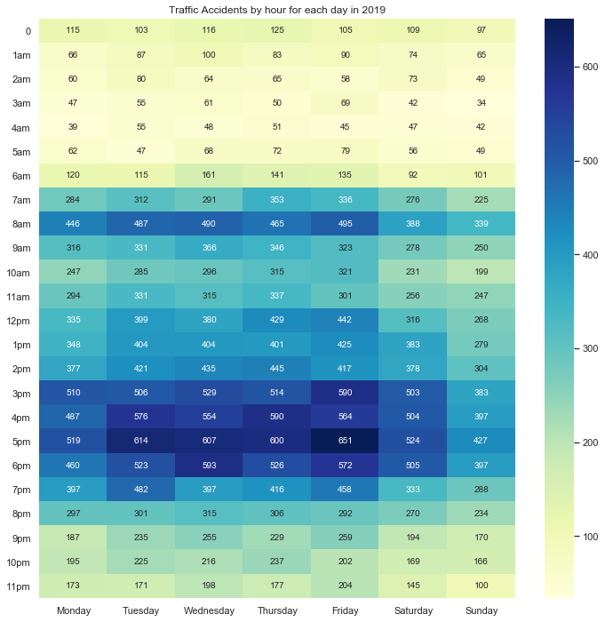
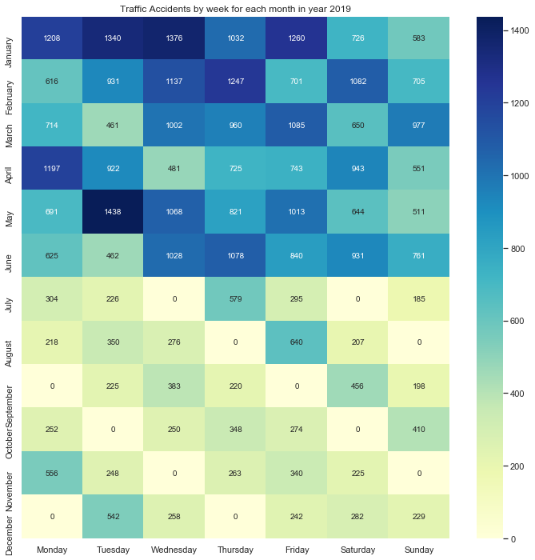

# Traffic-accident-analysis
Data analysis performed on past traffic accidents to get inferences and use the insights to help Emergency Response Team prioritize their manpower on days with high probability of traffic accidents. Prioritizing of manpower is important these days or in the following years as many organizations lack manpower due to the declining birthrate. 

#### Traffic Accidents by hour for each day in year 2019

    

The heatmap above shows there is a concentration of accidents during peak hours at 8am and between 3pm to 6pm. The reason for such concentration may be due to the fact those timings are when workers drive to work or back home. Emergency Response Team can consider increasing their manpower for shifts that falls within those timings and decreasing manpower for shifts that does not fall within those timing.

#### Traffic Accidents by week for each month in year 2019

    

The heatmap above shows us that there is a concentration of accidents during the start of the year. The reason for such concentration may be due to the fact that there are more possibility of drink driving during the New Year. Emergency Response Team can consider encouraging employees to take leave at the second half of the year rather than the start. 
